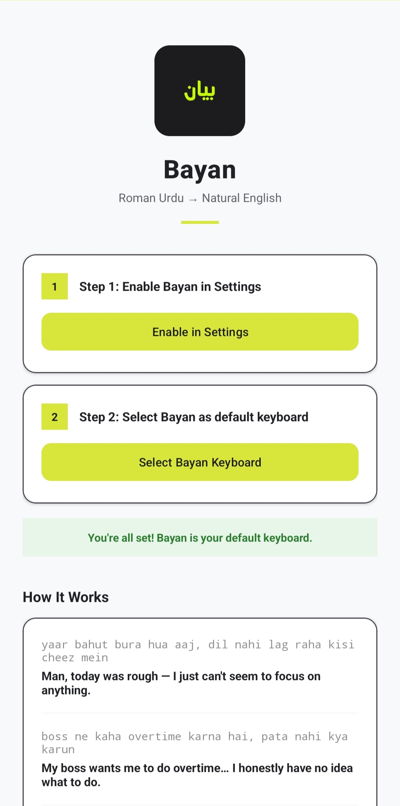
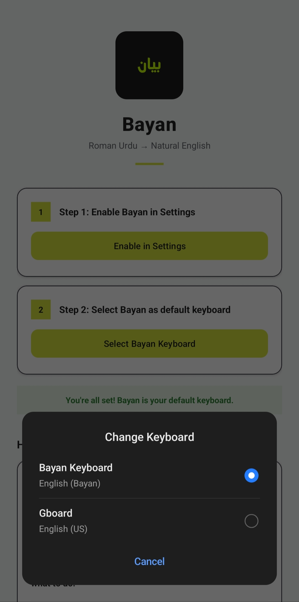
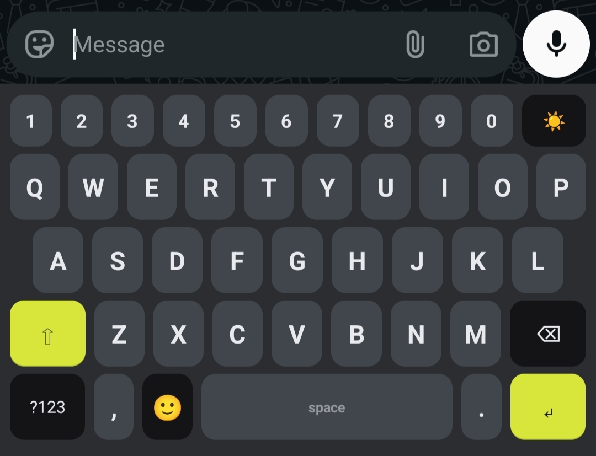
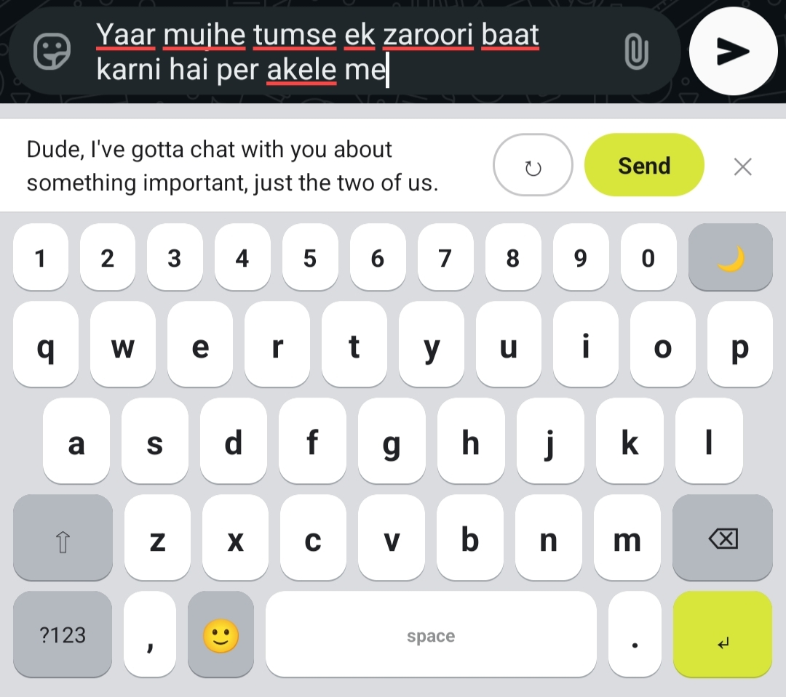
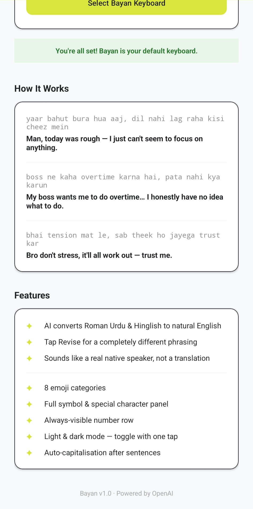

<h1 align="center">
    
  بیان &nbsp;·&nbsp; Bayan
</h1>

  <b>AI keyboard that turns Roman Urdu, Hinglish and broken English into fluent natural English as you type.</b> 
  Live suggestions in 1.5 seconds. One-tap revision. Built for Android.

  
  
  
  

---

## 🧠 What is Bayan?

Most Pakistanis and South Asians think in Urdu but need to write in English. The usual workflow is painful: type in Roman Urdu, copy it, paste into ChatGPT, copy the result, paste it back. Every single time.

**Bayan eliminates that entirely.**

It lives inside your keyboard. You type the way you naturally think, in Roman Urdu, Hinglish, or broken English, and Bayan rewrites it into natural, fluent English in real time. No app switching. No copy-paste. Just type and send.

---

## ✨ Features

- 🤖 &nbsp;**AI rewrite** — Roman Urdu, Hinglish and broken English converted to natural English
- ⚡ &nbsp;**Live suggestions** — AI fires automatically 1.5 seconds after you stop typing
- 🔁 &nbsp;**One-tap revision** — not happy with the suggestion? Hit Revise for a different phrasing
- 🌙 &nbsp;**Dark & light mode** — toggle with a single tap from the keyboard
- 🔢 &nbsp;**Always-visible number row** — no long-press needed
- 😊 &nbsp;**8 emoji categories** — faces, hands, animals, food, sports, vehicles, tech, symbols
- 🔣 &nbsp;**Full symbol panel** — all special characters in one tap
- 🔠 &nbsp;**Auto-capitalisation** — after sentences and on new input fields

---

## 🚀 How It Works

### Step 1 — Install & Set Up

Download the APK and open the Bayan app. Follow the two-step setup to enable and select Bayan as your default keyboard.

  

⬇️

  

---

### Step 2 — Open Any Chat and Start Typing

Open WhatsApp, Teams, Gmail, or any app. Bayan replaces your keyboard. Type freely in Roman Urdu or Hinglish.

  

⬇️

  

---

### Step 3 — Review and Send

After 1.5 seconds of no typing, Bayan shows a fluent English suggestion above the keyboard. Hit **Send** to replace your text instantly, **Revise** for an alternative, or just ignore it and keep typing.

---

## 📸 Screenshots

  
  &nbsp;&nbsp;
  
  &nbsp;&nbsp;
  

  
  &nbsp;&nbsp;
  

---

## 🛠 Tech Stack

| Layer | Technology |
|---|---|
| Language | Kotlin |
| Architecture | IME Service + Repository pattern |
| AI | OpenAI GPT-4o mini |
| Networking | Retrofit 2 + OkHttp |
| Async | Kotlin Coroutines |
| UI | Android View system + Material Design 3 |
| Theme | Dynamic dark/light with SharedPreferences |

---

## 🤝 Want to Try It?

Bayan is currently in early access. If you want to get your hands on it, discuss a collaboration, or just talk about the idea, reach out directly. Always happy to connect.

- 📧 &nbsp;[adeelmemon096@yahoo.com](mailto:adeelmemon096@yahoo.com)
- 💼 &nbsp;[linkedin.com/in/adeeliqbalmemon](https://linkedin.com/in/adeeliqbalmemon)

---

## 📬 Contact

**Adeel Iqbal**

- 📧 &nbsp;[adeelmemon096@yahoo.com](mailto:adeelmemon096@yahoo.com)
- 💼 &nbsp;[linkedin.com/in/adeeliqbalmemon](https://linkedin.com/in/adeeliqbalmemon)
- 🐙 &nbsp;[github.com/adeel-iqbal](https://github.com/adeel-iqbal)

---

  Built with ❤️ in Pakistan &nbsp;·&nbsp; Bayan v1.0 &nbsp;·&nbsp; Powered by OpenAI

